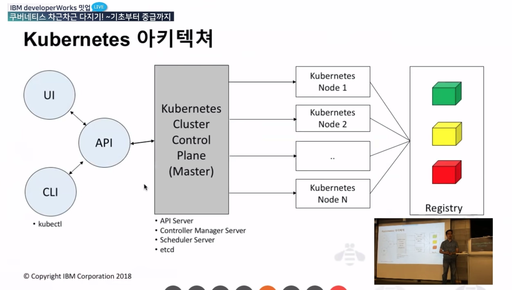
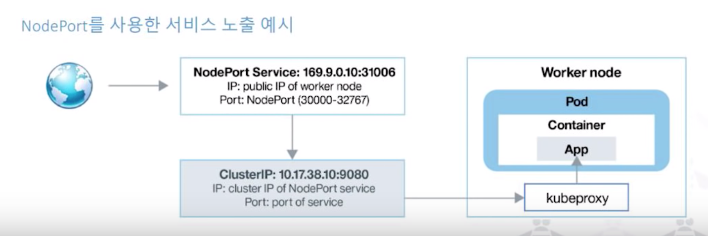
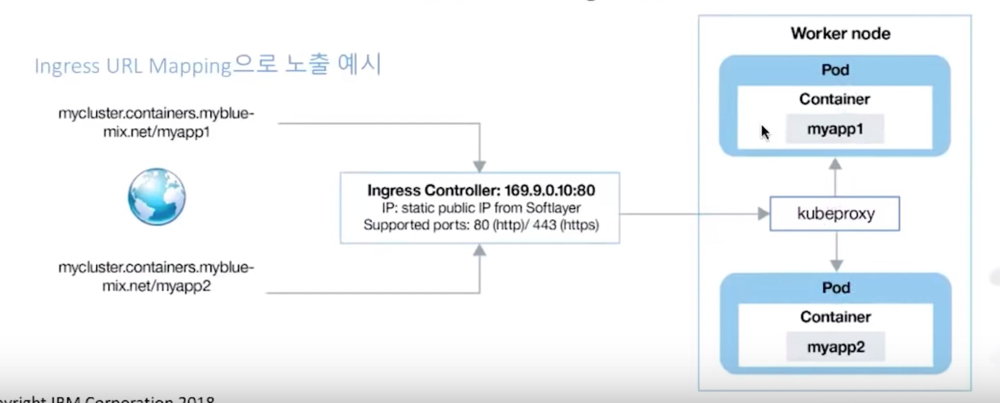

# Kubernetes

> source from [IBM developerWorks Meetup](https://www.youtube.com/watch?v=l42GttmnnZ4)

`Kubernetes(k8s)`: `Container Orchestration` tool.

# 1. Container Orchestration이 왜 필요한가?

컨테이너를 하나하나 돌리는 것은 간단하다. 하지만, 컨테이너 수가 기하급수 적으로 늘어나고 한 호스트에 올릴 수 없는 상황이 되면 컨테이너 간의 서비스 디스커버리, 네트워킹을 고려해야한다.

> `Container Orchestration`: 여러개의 컨테이너, 여러개의 호스트를 하나로 묶어서 관리할 수 있도록 하는 것.

하는 일:

- 스케쥴링
- Cluster 관리
- 서비스 discovery (클러스터 안의 수많은 워커노드 중에 A 서비스는 어디서 돌아가는가?)
- 모니터링
- 설정
- ... 등등

# 2. `Kubernetes` 란?

> Kubernetes: 구글이 오픈소스로 공개한 `Container Orchestration` tool.  
> 다양한 클라우드, 베어메탈 환경을 지원한다. AWS, Azure, IBM 모두 `Kubernetes`를 지원한다.

## 주요 장점

- `Automatic binpacking`  
  가용성에 대한 희생 없이, 리소스 사용과 제약 사항을 기준으로 자동으로 컨테이너를 스케쥴

  - `k8s`는 클러스터안에 여러개의 워커노드를 돌리는 것을 기본으로.
  - 클러스터에 어떤 워커노드에 컨테이너를 올릴것인가?

- `Self-healing`  
  자동으로 문제가 발생한 노드의 컨테이너를 대채 (룰/정책에 따른 헬스 체킹)
  - 노드가 죽었을 때, 다른 노드에다가 기존 노드에 있던 컨테이너를 옮겨주고.. 등등
- `Horizontal scaling`  
  CPU와 메모리와 같은 리소스 사요에 따라 자동으로 애플리케이션을 확장  
  경우에 따라서, 사용자 정의 측정 값을 기준으로 한 동적 확장 가능
  - 확장!
- `Service discovery and load balancing`  
  container에 고유한 ip부여
  여러 개의 Container를 묶어 단일 service로 부여하는 경우 단일 DNS name으로 접근하도록 로드 밸런싱 제공.
  - 수 많은 노드들에서 특정 노드를 찾고, load balancing하는 것은 어려운 일.
  - 네이밍 서비스를 제공해서 처리할 수 있도록 함.
- `Automatic rollouts and rollbacks`  
  다운타움 없이 application의 새로운 버전 및 설정에 대한 롤아웃/롤백 가능
  - 롤 아웃되는 버전만 선택해주면 자동으로 롤아웃/롤백.
- `Secret and configuration management`
  애플리케이션의 secret과 configuration 정보를 이미지와 독립 적으로 구분하여 별도의 이미지 재생성 없이 관리.
  - 기존의 암호, secret key등은 file로 저장했음.
  - stateless 방식에도 맞지 않고, 관리하기도 불편했음.
  - 이런 정보들을 저장하고 관리하는 시스템도 제공해줌.
- `Storage orchestration`  
  소프트웨어 정의 저장장치 (software defined storage)를 기반으로 로컬, 외부 저장소를 동일한 방법으로 컨테이너에 마운트 가능.
  - 생성된 데이터 들을 어디에 저장할 것인가? 사용자 자료를 어디에 저장할 것인가?
  - 쿠버네티스에서 관리 가능
  - 로컬 저장소, 외부 저장소(s3, sds 등)에 저장 가능
  - 자동 용량 할당, IOPS 지정 등등..
- Batch execution
  CI 워크로드와 같은 Batch성 작업 지원  
  crontab 형식으로 스케쥴링 가능
  - `batch`: **대량의 데이터**를 **특정 시간**에 **일괄적으로** 처리

# 3. Kubernetes 아키텍쳐



- `Node`: 일하는 곳. 워크로드가 올라감.
- `Registry`: `Docker hub`같은 역할. 컨테이너에 돌릴 이미지를 저장하는 곳.
- `Kubernetes Cluster Control Plane`(**`master`**): 워커노드를 관리.
  - `API 서버`: 사용자 UI 제공, 사용자 명령을 받을 수 있도록 제공.
  - `Controller Manager Server`
  - `Scheduler Server`: 스케쥴링, 워커노드 추가, 제거, 셀프 힐링 등등..
  - `etcd`: 사용자들이 입력한 정보들('내가 이런 서버들을 올릴거야') 저장

## `Kubernetes Cluster Control Plane (master)`

- `kube-apiserver`  
  클러스터와 상호작용을 위한 API 서버
- `kube-scheduler`  
  workder node에 있는 pod를 스케쥴한다.
- `kube-controller-manager`  
  Deployment, Replication Controller.
- `kube-cloud-manager`  
  Public Cloud provider 연동 관리
- `etcd`  
  저장소. 설정 및 데이터를 저장.

## `Kubernetes Node (Worker or Minion)`

- `Container runtime`  
  컨테이너 실행을 위한 Engine (`Docker Engine`)
- `kubelet`  
  Master의 명령을 전달하는 k8s 에이전트
- `kube-proxy`
  인바운드 혹은 아웃바운드 트래픽에 대한 네트워크 프록시 담당.
- `cAdvisor`  
  cAdvisor: `Container Advisor`  
  리소스 사용/성능 통계 제공 (우리 한가해요!, 바빠죽겠어요 뒤질래요?)

# 4. Kubernetes Object Model

- k8s object에 대한 설정, manifest를 `YAML` 형식으로 작성.
- Master 노드의 API Server를 통해 클러스터에 k8s object를 생성.

> `Kubernetes`에서 관리하는 모든 것은 `object`로 관리한다.

## Kubernetes Object API Version

- `Alpha` -> `Beta` -> `Stable`
  - apps/v1alpha
  - apps/v1alpha2
  - apps/v1beta
  - ...
  - apps/v1

ex)

```yaml
apiVersion: apps/v1beta2
kind: Deployment
metadata: ...
```

## Kubernetes Objects

- Basic Objects

  - `Pod`
  - `Service`
  - `Volume`
  - `Namespace`

- Controllers
  - `ReplicaSet`
  - `ReplicationController`
  - `Deployment`
  - `StatefulSets`
  - `DaemonSet`
  - `Garbage Collection`
  - `Jobs`
  - `CronJob`

## Pod

- Worker 노드에서 실행되는 컨테이너의 집합
- 하나의 pod에는 한 개 이상의 서비스로 지정 될 수 있음.
- 각각의 pod은 고유한 IP가 할당됨. (내부 IP)
- 하나의 pod내에는 PID namespace, network와 hostname을 공유

컨테이너를 돌리는 단위(?)  
일반적으로 한개의 컨테이너에 한개 BUT 한 `pod`에 여러 컨테이너 구동 가능.

## Service

그냥 pod 만들면 pod끼리 내부 통신은 가능하지만, 외부에서는 접속이 안됨.  
외부에서 접속시키게 하고싶다? 동일한 역할을 하는 `Pod`들에게 이름(`label`)을 붙이고, 그 `Pod`들을 묶어서 (`Service`) 외부에 노출시킴.

- Label Selecor로 선택하여 하나의 `endpoint`로 노출되는 `pod`의 집합.
- 종류: `ClusterIP`, `NodePort`, `LoadBalancer`, `ExternalName`



`pod`안의 `container`안의 `app`에 `kubeproxy`를 통해서 접속할 수 있다.  
`pod`의 `ip`를 하나하나 관리할 수 없기 때문에, `service`로 묶어서 `cluster ip`에 노출한다.

외부에 노출시키려면? `service`가 실행되는 node의 `port`로 노출시킴.

## Ingress



`169.9.0.10:80` 처럼 `ip`주소로 접속시키지 않고,  
도메인 + 파일 경로로 접속할 수 있게 해줌.

여러 서비스에 접속해야할 때, 한 도메인에 연결하고, 그 연결들을 알맞은 `service`에 연결해줘야 할 때 사용됨.

## ConfigMap

- Pod에 담겨진 container에서 사용되는 구성 값.
- DB 이름, 호스트, API 호스트
- 환경: `production`, `development`

## Secret

- 컨테이너에서 읽혀지거나 사용되는 소량의 민감한 정보
- 특수한 volume이 자동으로 연결되어 container에서 사용 가능
- 수동으로 secret을 생성 하고 연결하여 사용가능
- Base64로 encoding 될 뿐 암호화 되지는 않음.
- `Volume`으로 연결된 file 형식 또는 환경 변수 형식으로 사용 가능.

## ReplicaSet

- 구동하고 있는 `pod`의 숫자를 유지하고, 관리한다.
- 사용자 요청에 따라서 관리.
- 가용성, 확장성을 보장한다.
- 각각의 pod가 필요로하는 정보 명세가 있는 template을 이용.

---

1. `1.0` 버전의 `API` 서버가 있다.
2. 한 개의 `pod`에, 하나의 `container`를 구동시키고 있다. (이건 고정)
3. 커버리지를 높이고 싶어서, 동일한 `pod`을 여러개 띄우고 싶다.  
   &rarr; `ReplicaSet`으로 관리하여 `pod`의 갯수를 조절하고 관리한다.

---

## Deployment Controller

- `pod`의 배포 및 관리에 사용
- `ReplicaSet`을 자동으로 생성
- Pod에 대한 `rolling` 업데이트 관리

---

1. `1.0` 버전의 `API` 서버를 `ReplicaSet`으로 관리하고 있다.
2. 이 `API` 서버를 `1.1` 버전으로 업데이트 하고 싶다.  
   &rarr; `ReplicaSet`에 있는 `pod`에다가 버전 하나하나 올리기 힘들다.  
   &rarr; `1.1`버전의 `ReplicaSet`을 새로 만든다.  
   &rarr; **새 `ReplicaSet`을 배포하고, 기존의 `ReplicaSet`을 죽이는 등 관리를 `Deployment Controller`가 한다.**

## StatefulSet

- `Deployment`와 유사하나, 조금 더 중요한 `pod`들을 관리.
- `pod`에 고정된 `identity` (name, network id 등) 할당

## DaemonSet

- 모든 Node에 배포되어 실행
- Node 상태에 따른 Monitoring 용으로 주로 사용 (Storage 관리, log 수집 daemon 등)

## Job

- 특정 task 실행을 위해 하나 혹은 이상의 pod를 생성하고 실행
- `Pod`가 실행 완료하는 것을 보장 (실패시 재시도하고, 재시도 횟수 deadline 설정 가능)
- `Job` 실행 시 `Pod`의 순차 실행 또는 동시 실행 가능
- 모든 `Pod` 실행 완료 시 `Job`의 완료로 인식하고 사용한 `Pod`들을 제거함.

## Volume

아무리 `stateless`라 하더라도, 데이터를 저장할 공간이 필요함. (사용자 데이터 등)

- `Docker`에서는? `host path`를 `volume`으로 관리.
- `k8s`에서도 비슷하게 `worker node`의 `path`에 저장.
- 하지만 중요한 정보를 각각의 노드에 저장하면? 필요한 자료 찾기 힘듬.  
  &rarr; 공유하는 공간 필요.

* `Pod`에 연결되어 디렉토리 형태로 데이터를 저장 할 수 있도록 제공
* `Pod`의 `container`들 끼리 공유
* `Pod`와 `Life-cycle`이 동일하게 적용되어 `pod` 삭제 시 같이 삭제됨.

## PersistentVolume (PV)

- `k8s` 클러스터 관리자에 의해 제공된 저장소의 일부

* `Volume`과 유사하지만, `pod`과 독립적인 life-cycle을 가짐.
* 사용자가 용량, 모드 등 필요한 정보와 함께 `PVC(PersistentVolumeClain)`를 생성하면, 이에 대응하는 `PersistentVolume`이 연결됨.

# 5. `CLI` Tools

## `Kubernetes` Native Tools

- `kubectl`  
  대부분 사용됨.
  `k8s` 클러스터 관리자를 위한 `CLI` 도구

- `minikube`
  개발이나, 테스트를 목적으로 개인 PC에서 단일 노드 `k8s` 클러스터를 쉽게 제공하는 도구.

## `Kubernetes` 3rd party Tools - Kompose

- `Docker compose` 파일을 `k8s object`로 변환.
