# THIS TUTORIAL IS DEPRECATED

# CodePush + Sentry Tutorials

React Native에 `CodePush`를 통해 데이터 패치, `Sentry`를 통해 Crash Reporting을 해보자.

| Package                | Version |
| ---------------------- | ------- |
| React Native           | v0.57.7 |
| code-push-cli          | v2.1.9  |
| react-native-code-push | v5.5.0  |
| react-native-sentry    | v0.40.2 |

# CodePush

# 1. Login

> `$ npm install -g code-push-cli`

`code-push-cli`를 설치하고 기본 설정을 하자.

`code-push login`을 실행하면  
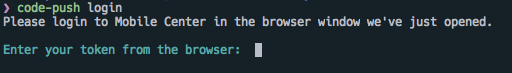

_cli_ 창에서 다음과 같이 출력되고, 웹 브라우저가 실행되며 로그인 화면이 나온다.
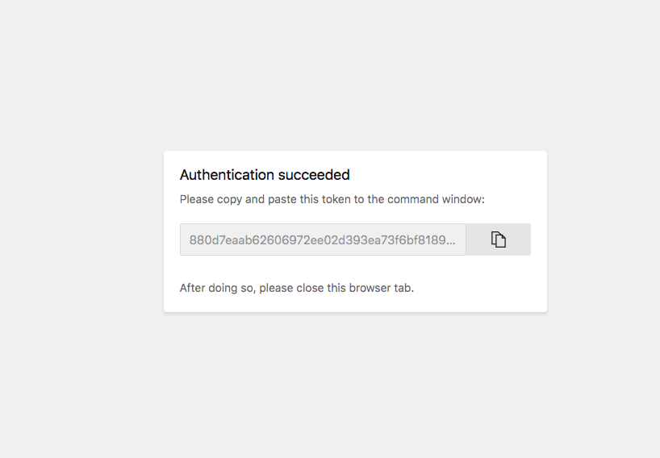

위의 *token*을 *cli*에 입력하면 로그인 완료.

# 2. App 생성

`code-push-cli`를 통해서 App을 생성한다.  
RN에서는 _Android_, _iOS_ 총 2개의 App을 생성해야 한다.

> Note, if you are targeting both platforms it is recommended to create separate CodePush applications for each platform.

`$ code-push app add <ProjectName> <OS> <Platform>`

예)

> `$ code-push app add CodePushSentryAndroid android react-native`

### Organization

Organization을 생성해서 프로젝트들을 묶어서 관리하고, 팀원들을 초대할 수 있다.
이 경우에는 [appcenter.ms](https://appcenter.ms)에서 _Organization_ 을 생성하고, *ProjectName*을 `<OrganizationName/ProjectName>`으로 설정하면 된다.

예)

> `$ code-push app add MobileTeam/CodePushSentryiOS ios react-native`

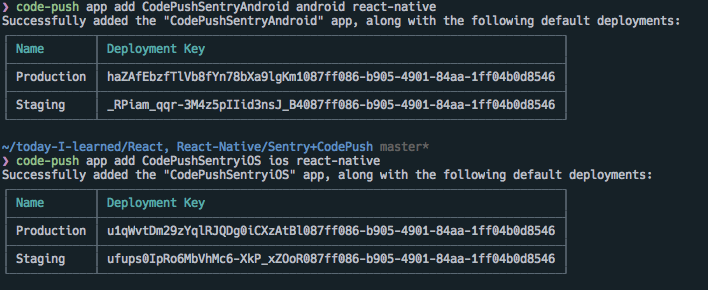
앱을 생성하면 다음과 같이 *Deployment Key*들이 출력된다.

_Production_, _Staging_ 총 2 개의 *Deployment Level*이 존재하고, 각 level은 개발용, 배포용으로 구분 할 수 있겠다.

`$ code-push deployment ls <ProjectName> -k`를 통해서 해당 키를 확인 할 수 있다.

# 3. installation

이제 SDK를 설치하자.

> `$ yarn add react-native-code-push`

#### 3.1 iOS Setup (Cocoapods)

이 글에서는 *Cocoapods*를 통해서 설치한다. 이외의 방법은 [링크](https://github.com/Microsoft/react-native-code-push/blob/master/docs/setup-ios.md) 참조.

_ios_ 폴더에서 `pod init`을 실행하고, *Project Root Dir*로 돌아와서  
`react-native link react-native-code-push`를 실행하자.
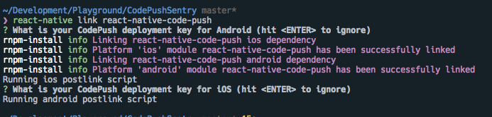

추가적인 *prompt*가 실행 될 것인데, 모두 *Enter*를 눌러서 무시하자.

그 후, `ios/Podfile`을 다음 코드들을 추가하자.

```Ruby
target 'CodePushSentry' do
  ...
  ...
  pod 'React', :path => '../node_modules/react-native', :subspecs => [
    'Core',
    'CxxBridge', # Include this for RN >= 0.47
    'DevSupport', # Include this to enable In-App Devmenu if RN >= 0.43
    'RCTText',
    'RCTNetwork',
    'RCTWebSocket', # Needed for debugging
    'RCTAnimation', # Needed for FlatList and animations running on native UI thread
    # Add any other subspecs you want to use in your project
  ]
  # Explicitly include Yoga if you are using RN >= 0.42.0
  pod 'yoga', :path => '../node_modules/react-native/ReactCommon/yoga'
  pod 'DoubleConversion', :podspec => '../node_modules/react-native/third-party-podspecs/DoubleConversion.podspec'
  pod 'glog', :podspec => '../node_modules/react-native/third-party-podspecs/glog.podspec'
  pod 'Folly', :podspec => '../node_modules/react-native/third-party-podspecs/Folly.podspec'

  # CodePush plugin dependency
  pod 'CodePush', :path => '../node_modules/react-native-code-push'
  ...
  ...
  ...
end

post_install do |installer|
  installer.pods_project.targets.each do |target|
    targets_to_ignore = %w(React yoga)
      if targets_to_ignore.include? target.name
        target.remove_from_project
      end
  end
end
```
`pod install` 실행하여 dependencies 설치하고,  
`open <ProjectName>.xcworkspace` 실행하여 XCode를 실행하자.

#### Multi Deployment Test

*Deployment Level*은 *Staging*과 *Production* 두 가지가 존재하여 각각 개발용, 배포용으로 사용가능하다.  
각 Level은 *Deployment Key*를 달리 사용하여 구별한다. 기존의 *Debug*, *Release* 두 가지 Build Configuration에 추가로, *Staging*을 추가하여 간단히 두 Level을 옮겨다니며 개발할 수 있다.

1. *Project navigator* 창에서 현재 프로젝트를 선택한다.
2. *Project navigator* 오른쪽 창에서 현재 프로젝트 선택한다. (Target 아님)
3. `Info` 탭으로 이동
4. `+` 버튼을 클릭하고 `Duplicate "Release" Configuration`를 선택한다.
   
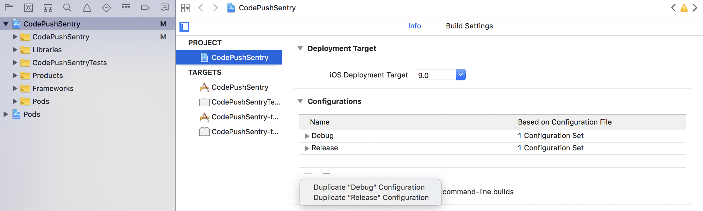

5. Configuration Name에 `Staging` 입력 (혹은 맘대로)
6. `Build Setting` 탭으로 이동.
7. `Build Location -> Per-configuration Build Products Path -> Staging` 에서 `Staging` 키 값을 `$(BUILD_DIR)/$(CONFIGURATION)$(EFFECTIVE_PLATFORM_NAME)`에서 `$(BUILD_DIR)/Release$(EFFECTIVE_PLATFORM_NAME)`로 변경한다.

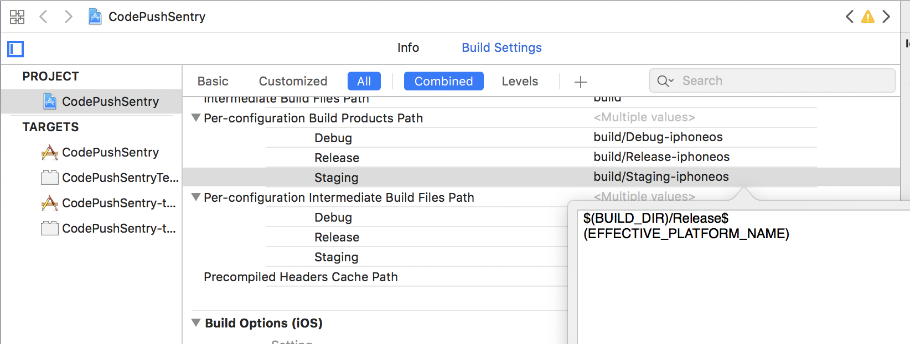

8. 상단의 `+` 버튼을 눌러 `Add User-Defined Setting`를 선택한다.


9. 해당 `setting`의 이름을 *CODEPUSH_KEY* 로 정하고, Release 키에 *Production Deployment Key*를, Staging 키에 *Staging Deployment Key*를 입력한다.
* *Deployment Key*는 `code-push deployment ls <ProjectName> -k` 명령어를 통해 확인 가능하다.

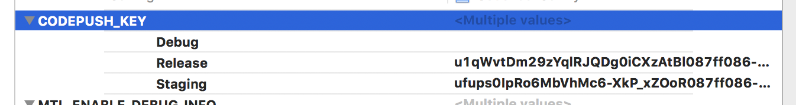

10. 프로젝트의 *Info.plist*파일을 열고, *CodePushDeploymentKey* 키를 `$(CODEPUSH_KEY)`로 설정하자.

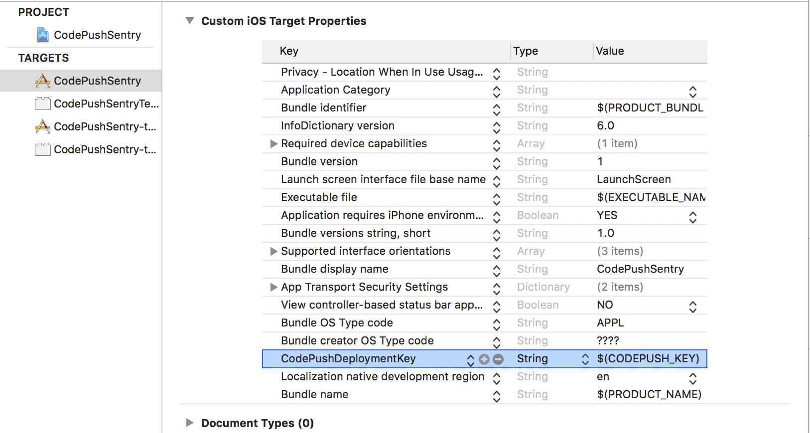

이후 `CMD + SHIFT + ,`를 입력하고 Build Configuration을 `release`로 설정한후 앱을 실행시켜보자.
빌드하는 동안, `App.js`파일을 다음과 같이 수정하자.

```jsx
import React, { Component } from 'react';
import { Platform, StyleSheet, Text, View, Button, Alert } from 'react-native';
import CodePush from 'react-native-code-push';

class App extends Component {
  state = {
    syncMessage: null,
    progress: {
      receivedBytes: null,
      totalBytes: null,
    },
  };
  codePushStatusDidChange = (syncStatus) => {
    switch (syncStatus) {
      case CodePush.SyncStatus.CHECKING_FOR_UPDATE:
        this.setState({ syncMessage: 'Checking for update.' });
        break;
      case CodePush.SyncStatus.DOWNLOADING_PACKAGE:
        this.setState({ syncMessage: 'Downloading package.' });
        break;
      case CodePush.SyncStatus.AWAITING_USER_ACTION:
        this.setState({ syncMessage: 'Awaiting user action.' });
        break;
      case CodePush.SyncStatus.INSTALLING_UPDATE:
        this.setState({ syncMessage: 'Installing update.' });
        break;
      case CodePush.SyncStatus.UP_TO_DATE:
        this.setState({ syncMessage: 'App up to date.', progress: false });
        break;
      case CodePush.SyncStatus.UPDATE_IGNORED:
        this.setState({ syncMessage: 'Update cancelled by user.', progress: false });
        break;
      case CodePush.SyncStatus.UPDATE_INSTALLED:
        this.setState({ syncMessage: 'Update installed and will be applied on restart.', progress: false });
        break;
      case CodePush.SyncStatus.UNKNOWN_ERROR:
        this.setState({ syncMessage: 'An unknown error occurred.', progress: false });
        break;
    }
  };

  codePushDownloadDidProgress = (progress) => {
    this.setState({ progress });
  };

  syncImmediate = () => {
    try {
      CodePush.sync(
        {
          installMode: CodePush.InstallMode.IMMEDIATE,
          updateDialog: {
            title: '새로운 업데이트가 존재합니다.',
            optionalUpdateMessage: '지금 업데이트하시겠습니까?',
            mandatoryContinueButtonLabel: '계속',
            mandatoryUpdateMessage: '업데이트를 설치해야 사용할 수 있습니다.',
            optionalIgnoreButtonLabel: '나중에',
            optionalInstallButtonLabel: '업데이트',
          },
        },
        this.codePushStatusDidChange,
        this.codePushDownloadDidProgress,
      );
    } catch (e) {
      console.log(e);
      Alert.alert('Sync Error', JSON.stringify(e));
    }
  };

  render() {
    return (
      <View style={styles.container}>
        <Text style={styles.title}>Production</Text>
        <Text style={styles.title}>Version 1</Text>
        <Button title='Sync' onPress={this.syncImmediate} />
        <Text style={styles.messages}>{this.state.syncMessage || ''}</Text>

        <Text style={styles.messages}>
          {this.state.progress
            ? `${this.state.progress.receivedBytes || 0} of ${this.state.progress.totalBytes || 0} bytes received`
            : null}
        </Text>
      </View>
    );
  }
}

const styles = StyleSheet.create({
  container: {
    flex: 1,
    justifyContent: 'center',
    alignItems: 'center',
    backgroundColor: '#F5FCFF',
  },
  title: {
    fontSize: 40,
    fontWeight: 'bold',
  },
});

const codePushConfig = { checkFrequency: CodePush.CheckFrequency.MANUAL };
export default CodePush(codePushConfig)(App);

```

정상적으로 Build 되었다면 다음과 같이 앱이 실행될것이다.
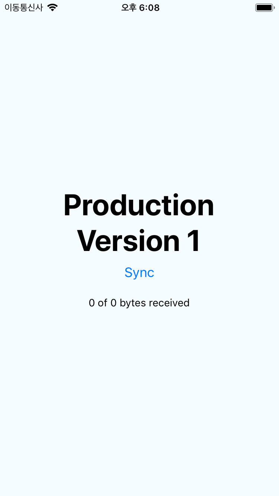

*Sync* 버튼을 눌러서, `App up to date`가 표시된다면 정상 작동 하는 것이다.

#### 3.2 Android Setup
안드로이드는 간단하다.
*iOS* 셋업하면서 `react-native link react-native-code-push`를 실행했을 것이다.
기본적인 것은 전부 설정되었을 것이고, *Multi Deployment Test* 만 하면된다.

나 처럼 `react-native link` 를 불신하는 사람들은 [링크](https://github.com/Microsoft/react-native-code-push/blob/master/docs/setup-android.md)를 확인해서 잘 되었는지 확인하자.

* 여기서 *keystore* 설정을 해서 *release* 빌드를 해야한다. 이 부분은 설명하지 않겠다.

#### Multi Deployment Test

1. `android/app/build.gradle` 파일 오픈
2. `android` - `buildTypes` 부분에 `debug`와 `releaseStaging`을 추가하고, 다음과 같이 변경하자.
```gradle
android {
    ...
    buildTypes {
        debug {
            ...
            // Debug 모드에서는 CodePush가 작동하지 않으나, 에러는 나지않게 빈 스트링을 넣어주자.
            matchingFallbacks = ['debug']
            buildConfigField "String", "CODEPUSH_KEY", '""'
            ...
        }

        releaseStaging {
            matchingFallbacks = ['release']
            minifyEnabled enableProguardInReleaseBuilds
            proguardFiles getDefaultProguardFile("proguard-android.txt"), "proguard-rules.pro"
            signingConfig signingConfigs.release
            buildConfigField "String", "CODEPUSH_KEY", '"<Staging 키 입력>"'
        }

        release {
            ...
            matchingFallbacks = ['release']
            minifyEnabled enableProguardInReleaseBuilds
            proguardFiles getDefaultProguardFile("proguard-android.txt"), "proguard-rules.pro"
            signingConfig signingConfigs.release
            buildConfigField "String", "CODEPUSH_KEY", '"<Production 키 입력>"'
            ...
        }
    }
    ...
}
```

* 작은 따옴표 안에 큰 따옴표 빼먹으면 안된다.
* `releaseStaging`이라는 이름은 변경하면 안된다. 이유는 [링크](https://github.com/facebook/react-native/blob/e083f9a139b3f8c5552528f8f8018529ef3193b9/react.gradle#L79)

3. 이제 해당 키를 `MainApplication.java`에 전달하자.
```java
@Override
protected List<ReactPackage> getPackages() {
    return Arrays.<ReactPackage>asList(
        ...
        new CodePush(BuildConfig.CODEPUSH_KEY, MainApplication.this, BuildConfig.DEBUG), // Add/change this line.
        ...
    );
}
```

다 끝났다. `react-native run-android --variant=release` 실행하여 디바이스에 올려보자.

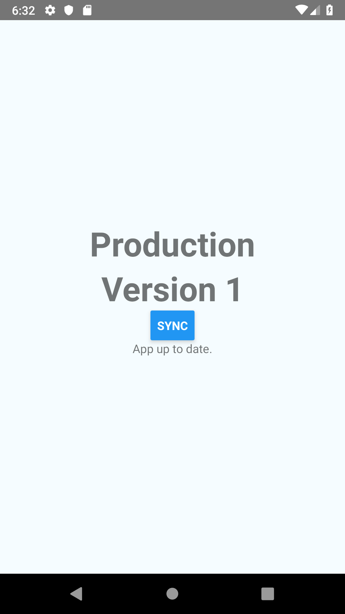
ios와 같이 작동하면 완성.

# 4. Release

시뮬레이터를 두 개 킨 다음, 두 개에 모두 앱을 올려보자.


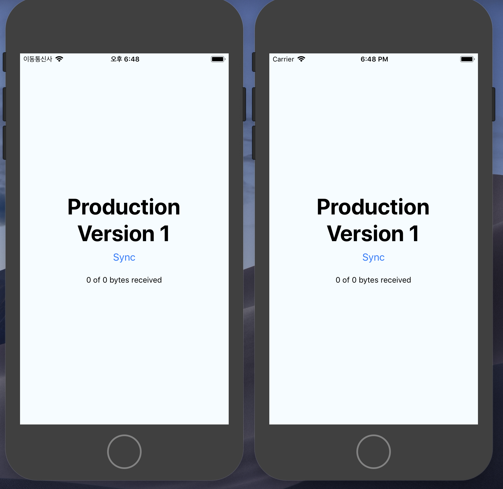

그 후 `App.js` 소스를 수정하고, 시뮬레이터 하나에만 `Staging(ios) / releaseStaging(android)` 빌드로 올려보자.

> ios는 `CMD + SHIFT + ,`를 통해 build configuration 변경
> android는 `react-native run-android --variant=[release, releaseStaging]`으로 변경

```jsx

  render() {
    return (
      <Text style={styles.title}>Staging</Text>
      <Text style={styles.title}>Version 2</Text>
    ) 
  }

```

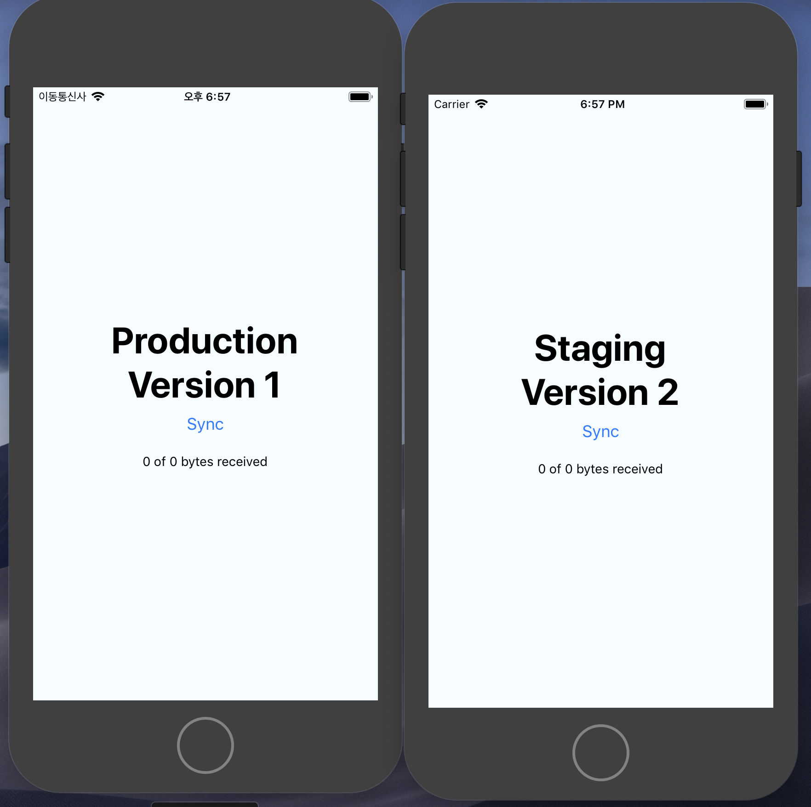
왼쪽은 `Production` 빌드이고, 오른쪽은 `Staging` 빌드이다.
아까 설명한 것 처럼 *CodePush*는 *2 개의 Deployment Level*이 존재한다. 한번에 두 개의 빌드레벨에 모두 배포할 수는 없으며, 한번에 한 레벨에만 배포가 가능하다.

배포 해봄과 동시에 *Deployment level*을 구별해서 배포해보자.

위 처럼 `App.js`를 수정한 후, RN Root 디렉토리에서  
`code-push release-react <ProjectName> <os> -d Staging`을 실행하자.

> 예) `code-push release-react CodePushSentryiOS ios -d Staging`

위 커맨드를 실행하면 *bundle*이 생성되고 Codepush 서버에 업로드 된다.
그 후, 두 시뮬레이터에서 `Sync`버튼을 눌러보자.

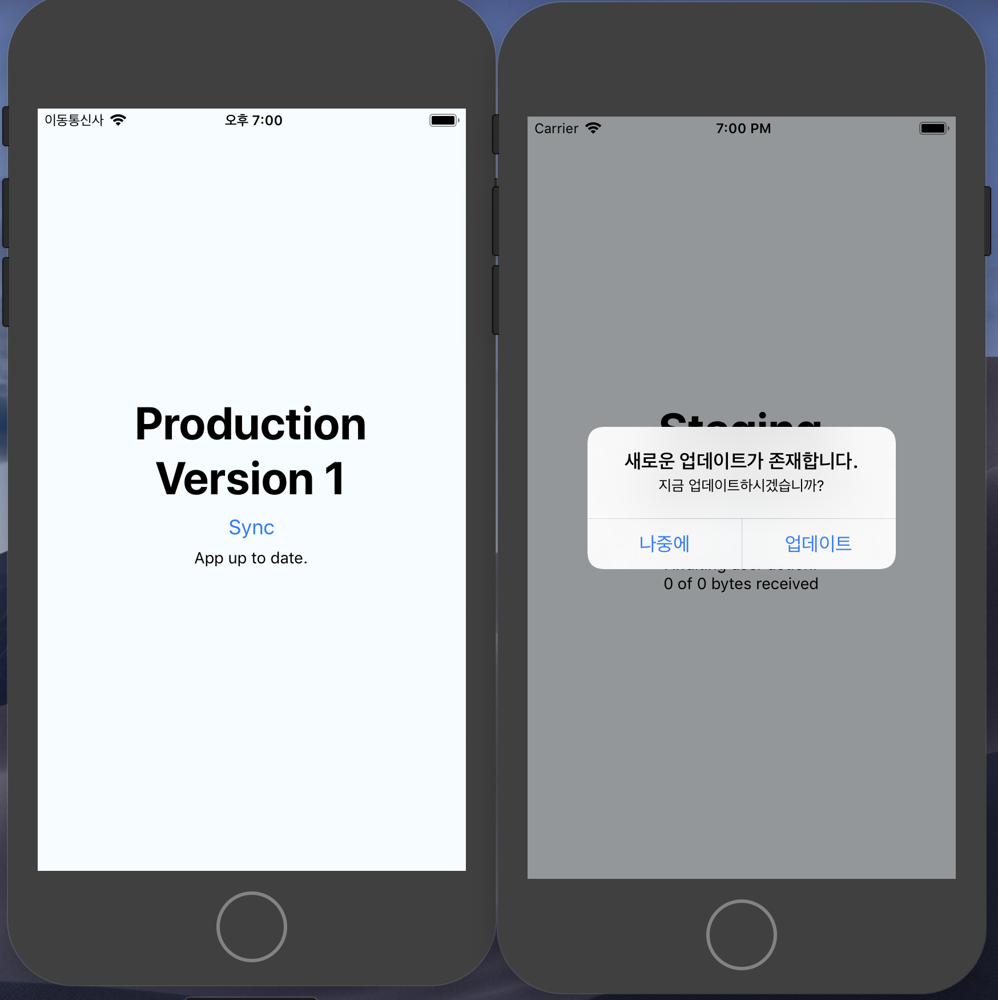

`Staging(ios) or releaseStaging(android)`로 빌드한 앱에만 업데이트가 반영된다.

한번 더, `App.js` 소스를 수정하고, `release` 빌드로 올려보자.

```jsx
  render() {
    return (
      <Text style={styles.title}>Production</Text>
      <Text style={styles.title}>Version 3</Text>
    ) 
  }
```

`code-push release-react <ProjectName> <os> -d Production` 실행!  
그 후, 두 시뮬레이터에서 `Sync`버튼을 눌러보면
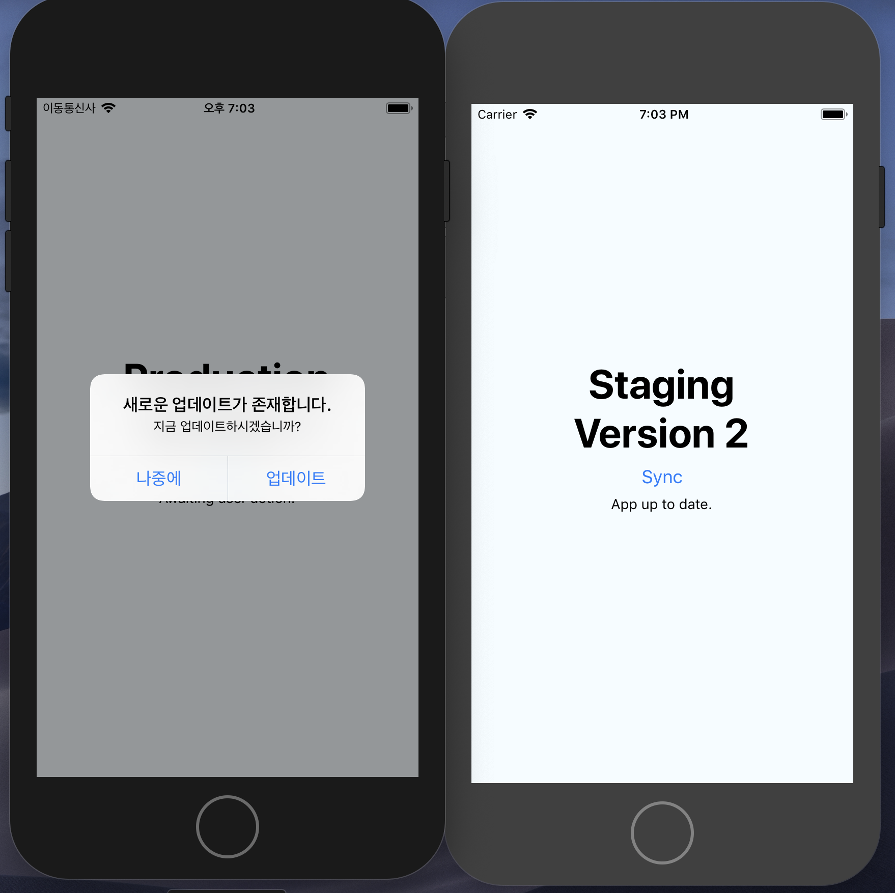

이번에는 *Production Deployment key*로 빌드한 *release* 빌드에만 반영된다.

이 예제는 *ios*에만 반영한 것이고 실제 개발 할 때는 *android* 도 같이 반영해주자.

CodePush의 자세한 사용법은 [react-native-code-push](https://github.com/Microsoft/react-native-code-push)와 [appcenter docs](https://docs.microsoft.com/en-us/appcenter/distribution/codepush/)를 참고하자.
